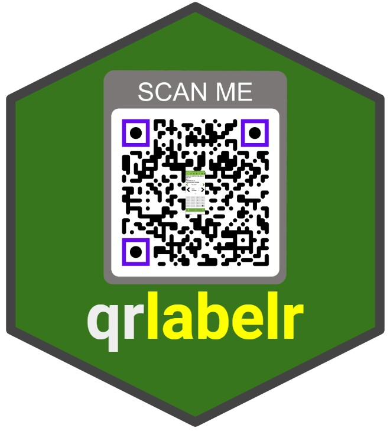

{style="display: block; margin-left: auto; margin-right: auto;"
width="287"}

# Create Plot Labels Easily With qrlabelr

qrlabelr is a no-frills R package for designing experimental or trial
plot labels affixed with QR codes for digital data collection. This
package comes with EasyPlotLabelR, an open-source software that
simplifies the complicated process of plot label design. It generates
plot labels that are compatible with the widely used digital data
collection mobile app, Field Book.

Submit bug reports and feature suggestions, or track changes on the
[issues page](https://github.com/awkena/qrlabelr/issues).

## Table of contents

-   Requirements
-   Recommended modules
-   Installation
-   Usage
-   Troubleshooting
-   FAQ
-   Authors
-   License
-   Features
-   Tech stack
-   Support and Feedback
-   Related

## Requirements

To run this package locally on a machine, the following R packages are
required:

-   [argonDash](https://rinterface.github.io/argonDash/): Argon Shiny
    Dashboard Template

-   [argonR](https://cran.r-project.org/package=argonR): R Interface to
    Argon HTML Design

-   [bslib](https://rstudio.github.io/bslib/): Custom 'Bootstrap' 'Sass'
    Themes for 'shiny' and 'rmarkdown'

-   [dplyr](https://www.rdocumentation.org/packages/dplyr/versions/0.7.8):
    A fast, consistent tool for working with data frame like objects,
    both in memory and out of memory

-   [grid](https://stat.ethz.ch/R-manual/R-devel/library/grid/html/00Index.html):
    A rewrite of the graphics layout capabilities, plus some support for
    interaction

-   [purrr](https://CRAN.R-project.org/package=purrr): A complete and
    consistent functional programming toolkit for R.

-   [qrencoder](https://CRAN.R-project.org/package=purrr): Make QR codes
    in *R*

-   [raster](https://rspatial.org/raster/pkg/index.html): Geographic
    Data Analysis and Modeling. Reading, writing, manipulating,
    analyzing and modeling of spatial data

-   [reactable](https://glin.github.io/reactable/): Interactive data
    tables for *R*, based on the React Table JavaScript library

-   [shiny](https://shiny.rstudio.com/): Makes it incredibly easy to
    build interactive web applications with *R*

-   [shinycssloaders](https://github.com/daattali/shinycssloaders): Add
    loading animations to a 'shiny' output while it is recalculating

-   [shinyjs](https://deanattali.com/shinyjs/): Easily improve the user
    experience of your Shiny apps in seconds

-   [shinyWidgets](https://github.com/dreamRs/shinyWidgets): Collection
    of custom input controls and user interface components for 'Shiny'
    applications

-   [tools](https://www.rdocumentation.org/packages/tools/versions/3.6.2):
    Tools for package development, administration and documentation.

## Recommended packages

-   [Rtools](https://cran.r-project.org/bin/windows/Rtools/rtools43/rtools.html):
    Needed for package development.
-   [rmarkdown](https://CRAN.R-project.org/package=rmarkdown): When
    installed, display of the project's README.md help will be rendered
    with R Markdown.

## Installation

Install as you would normally install an R package from GitHub

#### Installing from GitHub

First install the `devtools` package and all required dependencies using
the command:

``` r
  install.packages("devtools")
```

Then run the following code:

``` r
  devtools::install_github("awkena/qrlabelr")
```

#### Installing from a source package

-   Click Packages in the top-left corner
-   Click the *Install* button
-   From the *Install from:* drop-down menu, choose **Package Archive
    File**
-   Click the *Browse button* below and navigate to the qrlabelr source
    package
-   Double click the package or click *Open*
-   Click the *Install* button to install the package

## Usage

Run the following code in the RStudio console to launch the
EasyPlotLabelR Shiny app:

``` r
  qrlabelr::run_app()
```

## Troubleshooting

If the app does not run as expected, check the following:

-   Was the package properly installed?

-   Were any warnings or error messages returned on package
    installation?

-   Do you have the required dependencies installed?

-   Are all packages up to date?

## FAQ

#### How much does it cost to use this app?

This app is free of charge.

#### Can I use fieldbooks generated with FielDHub?

Yes, you can. This is in fact the recommended approach.

#### Can I use my own generated fieldbooks?

Yes, you can. However, you would have to manually select the input ID
for the various column names/ parameters in the app.

#### How do I access my generated labels?

On the Generate labels page, there is a download button which can be
used to save all generated labels to a local machine.

#### Are generated labels compatible with popular page templates?

Yes. We have gone the extra mile to ensure generated labels can be
printed on papers from Avery, Uline, and other paper template
manufacturers.

## Authors

-   [Alexander Wireko Kena](https://www.github.com/awkena)
-   [Ebenezer Ogoe](https://github.com/Ebenezer-007)
-   [Clara
    Cruet-Burgos](https://www.researchgate.net/profile/Clara-M-Cruet-Burgos)
-   [Geoffrey Preston
    Morris](https://www.researchgate.net/profile/Geoffrey-Morris)

## License

[GNU GPLv3](https://choosealicense.com/licenses/gpl-3.0/)

## Features

-   Simplifies the process of plot label design.
-   Generates plot labels compatible with the widely used digital data
    collection mobile app, FielDHub.
-   Uses an informative unique ID to generate QR codes with different
    error correction levels.
-   Allows for both preset common label templates and custom rectangular
    label design.
-   Outputs a downloadable PDF file for printing and allows for
    downloading an updated field book.

## Tech Stack

R, HTML, CSS, JavaScript

## Support and Feedback

For support and submission of feedback, email the maintainer **Alexander
Kena** at
[alex.kena24\@gmail.com](mailto:alex.kena@gmail.com){.email}

## Roadmap

-   Add more features
-   Find and fix bugs

## Related

Below are some related projects

[FielDHub](https://didiermurillof.github.io/FielDHub/index.html): A
Shiny App for Design of Experiments in Life Sciences
