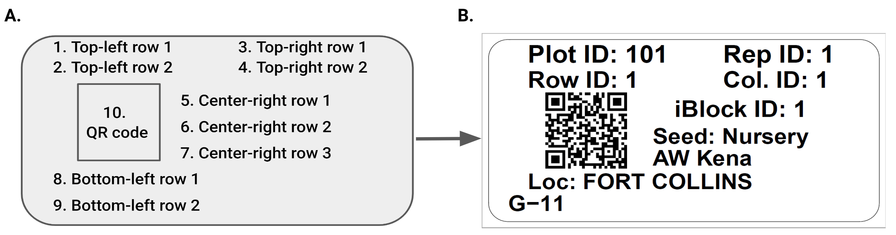
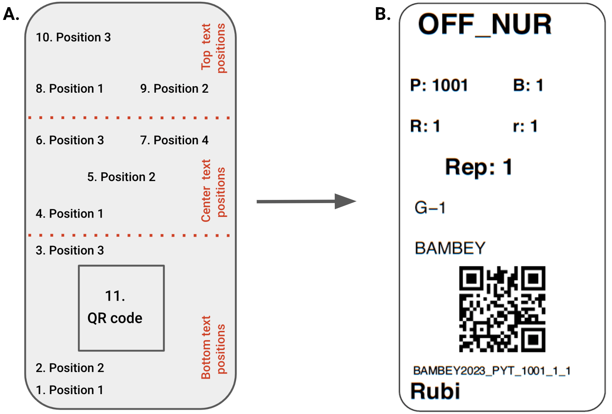
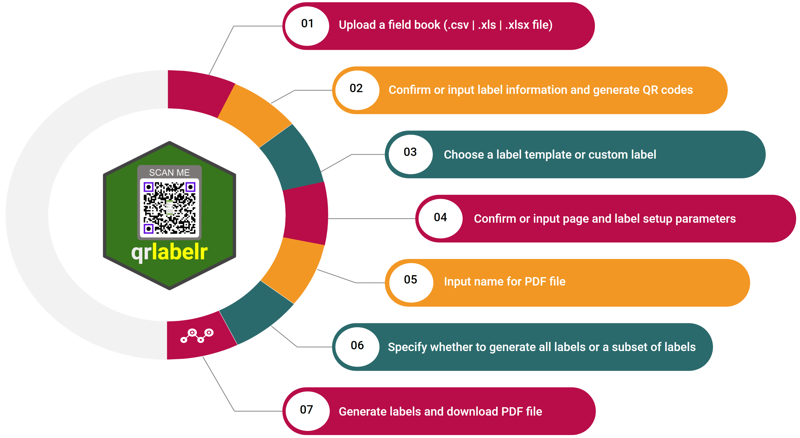

# qrlabelr   

<br>  

<!-- badges: start -->

[](https://github.com/awkena/qrlabelr/actions/workflows/OScheck.yml)
[](https://github.com/awkena/qrlabelr/actions/workflows/codecov3.yml)
[](https://app.codecov.io/gh/awkena/qrlabelr?branch=main)
<!-- badges: end -->

# Create Plot Labels Easily With qrlabelr

A no-frills open-source solution for designing print-ready labels affixed with QR codes. '**`qrlabelr`**' is an R package that features '**EasyQrlabelr**', a 'shiny' app that simplifies the complicated process of plot label design for non-R users. It also offers easily 'customizable' functions that enable label generation outside the 'shiny' app. It generates plot labels that are compatible with the widely used digital data collection mobile app, Field Book. Our software builds on the foundation of an existing open-source program, `('baRcodeR')` to offer more flexibility in plot label creation steps; guarantees true string fidelity after QR encoding; and provides faster label generation to users.

Submit bug reports and feature suggestions, or track changes on the
[issues page](https://github.com/awkena/qrlabelr/issues).

# Table of contents

- [Requirements](#requirements)
- [Recommended packages](#recommended-packages)
- [Installation](#installation)
- [Usage](#usage)  
  - [Generating field books](#generating-field-books)  
  - [Plot label design options](#plot-label-design-options  )  
  - [Label content](#label-content)  
  - [QR code generation](#qr-code-generation)  
  - [Creating field plot labels in R](#creating-field-plot-labels-in-r)  
  - [Creating general-purpose labels in r](#creating-general-purpose-labels-in-r)   
  - [Creating labels with shiny app: 'EasyQrlabelr'](#creating-labels-with-shiny-app-easyqrlabelr)  
  
        
- [Troubleshooting](#troubleshooting)
- [FAQ](#FAQ)
- [Authors](#authors)
- [License](#license)
- [Features](#features)
- [Tech stack](#tech-Stack)
- [Support and Feedback](##support-and-feedback)
- [Related](#related)


# Requirements

To run this package locally on a machine, the following R packages are
required:

-   ['argonDash'](https://rinterface.github.io/argonDash/): Argon 'shiny'
    Dashboard Template

-   ['argonR'](https://cran.r-project.org/package=argonR): R Interface to
    Argon HTML Design

-   ['bslib'](https://rstudio.github.io/bslib/): Custom 'Bootstrap' 'Sass'
    Themes for 'shiny' and 'rmarkdown'

-   ['dplyr'](https://www.rdocumentation.org/packages/dplyr/versions/0.7.8):
    A fast, consistent tool for working with data frame like objects,
    both in memory and out of memory

-   ['grid'](https://stat.ethz.ch/R-manual/R-devel/library/grid/html/00Index.html):
    A rewrite of the graphics layout capabilities, plus some support for
    interaction

-   ['purrr'](https://CRAN.R-project.org/package=purrr): A complete and
    consistent functional programming toolkit for R.

-   ['qrencoder'](https://CRAN.R-project.org/package=qrencoder): Quick Response          Code (QR Code) / Matrix 'Barcode' Creator

-   ['raster'](https://rspatial.org/raster/pkg/index.html): Geographic
    Data Analysis and Modeling. Reading, writing, manipulating,
    analyzing and modeling of spatial data

-   ['reactable'](https://glin.github.io/reactable/): Interactive data
    tables for *R*, based on the React Table JavaScript library

-   ['shiny'](https://shiny.posit.co/): Makes it incredibly easy to
    build interactive web applications with *R*

-   ['shinycssloaders'](https://github.com/daattali/shinycssloaders): Add
    loading animations to a 'shiny' output while it is recalculating

-   ['shinyjs'](https://deanattali.com/shinyjs/): Easily improve the user
    experience of your 'shiny' apps in seconds

-   ['shinyBS'](https://CRAN.R-project.org/package=shinyBS): Twitter Bootstrap           Components for 'shiny'

-   ['shinyWidgets'](https://github.com/dreamRs/shinyWidgets): Collection
    of custom input controls and user interface components for ''shiny''
    applications
    
-   ['uuid'](https://CRAN.R-project.org/package=uuid): Tools for Generating and       Handling of UUIDs

-   ['tools'](https://www.rdocumentation.org/packages/tools/versions/3.6.2):
    Tools for package development, administration and documentation.

# Recommended packages

-   ['Rtools'](https://cran.r-project.org/bin/windows/Rtools/rtools43/rtools.html):      Needed for package development.

-   ['rmarkdown'](https://CRAN.R-project.org/package=rmarkdown): When
    installed, display of the project's README.md help will be rendered
    with R Markdown.

# Installation

To install **`qrlabelr`**, you will first need to have R and the 'RStudio' IDE installed on your computer. Once you have these tools installed, you can open 'RStudio' and enter the following command in the console to install the package from CRAN:  

``` r
install.packages("qrlabelr")
```

The development version of **`qrlabelr`** can be installed from GitHub as follows:

``` r
install.packages("devtools")
```

Now, install the qrlabelr package by running the following commands: 
``` r
devtools::install_github("awkena/qrlabelr")
```

Alternatively, you can install the package together with its vignettes as follows:
``` r
devtools::install_github("awkena/qrlabelr", build_vignettes = TRUE)
```

One must have the `knitr` package installed before vignettes can be built during package installation.  

To view vignettes for the package in 'RStudio', run the following code in the R console:  

``` r
utils::vignette("qrlabelr")
```

Similarly, the vignette can be viewed in your browser by running the following code in your R console:  

``` r
utils::browseVignettes("qrlabelr")
```

The method described above will download and install the `qrlabelr` package on your computer. Once the installation is complete, you can load the package by entering the following command in the console:

``` r
library(qrlabelr)
```

**Users who have R and 'RStudio' already installed must ensure they are up to date before installing qrlabelr. All installed packages must also be updated before installing qrlabelr from GitHub**  

# Usage
## Generating field books
To use qrlabelr, one must first generate a field book or data input that shows individual experimental plot or label attributes. **A field or study book is required as an input data input in qrlabelr.**  

Typically, layout information for field plots are obtained based on the experimental design and treatment randomization. For field plot labels, it is strongly recommended to have the grid coordinates of plots (row and column numbers of plots) included in the field book.

There are free open-source software such as ['FielDHub'](https://github.com/DidierMurilloF/FielDHub), which users can use to easily generate an input field book for plot label design in qrlabelr. Other user-preferred software such as 'BMS' can equally be used to generate an input field book if desired.  

**Input data must be imported as a data frame into qrlabelr for use. We recommend that users save input data as 'csv' or as 'xls' or 'xlsx' files for easy import to 'qrlabelr'**  

## Plot label design options  
The qrlabelr package offers two user-centered options for creating plot labels affixed with QR codes.  

The first option involves the use of customizable functions to create rectangular field plot labels or any rectangular general-purpose labels embossed with QR codes. This option is for users who find working in R comfortable.  

The package also provides a helper function to access a user-friendly shiny app ('EasyQrlabelr') for non-R users who may find working in R not so comfortable. This option allows users to run the 'shiny' app using their computer as host without the need for internet.  

**Both the customizable functions and 'shiny' app were created to deliver the exact same features, so it all boils down to a user's preference.**  


## Label content
The qrlabelr package designs machine and human-readable plot labels. The specific information that is displayed on labels depends on whether one is designing **field plot labels** for field experiments or any **general purpose label**.  The general-purpose label option comes with two text orientation formats on the label: landscape (Figure 1) and portrait (Figure 2) formats.

Figure 1 and 2 show delineated text positions available to users that can be filled with human-readable texts and machine-readable QR code.  

||
|:--:| 
| *Fig. 1. Plot label design and content in qrlabelr for a landscape text orientation label format. A. There are nine (9) delineated text positions and 1 QR code position for any rectangular label (A). For a field plot label, the nine delineated text positions are mapped to specific human-readable texts by default as shown in B.* |. 

||
|:--:| 
| *Fig. 2. Plot label design and content in qrlabelr for a portrait text orientation label format. A. There are ten (10) delineated text positions and 1 QR code position for any rectangular label with portrait text orientation. B. An example of a general-purpose label with a portrait text orientation.* |. 


For a field plot label option, a landscape text orientation is used. The nine (9) text positions are mapped by default to the following human-readable texts as shown in Figure 1.  

1. Top-left row 1 text position is mapped to **Plot ID**      
2. Top-left row 2 text position is mapped to **Row ID**   
3. Top-right row 1 text position is mapped to **Rep ID**    
4. Top-right row 2 text position is mapped to **Column ID**    
5. Center-right row 1 text position is mapped to **intra-block ID** number if the field    layout is based on an incomplete block design     
6. Center-right row 2 text position is mapped to **seed source** for entries (optional)  
7. Center-right row 3 text position is mapped to **name of researcher** (optional)    
8. Bottom-left row 1 text position is mapped to **Location of experiment** or trial    
9. Bottom-left row 2 text position is mapped to **Entry name**     

**To change any of these default human-readable texts to user-preferred texts, use the `gp_label()` customizable function in R or the `General-purpose landscape text label` method in the 'shiny' app.**. 


## QR code generation  
Affixing QR codes on labels makes them machine-readable for easy plot/sample identification and tracking. The text for generating QR codes must be unique for each plot/sample.  

The qrlabelr package provides three methods for producing unique IDs for each plot. These methods are **reproducible unique IDs (`RUID`)**, **universal unique IDs (`UUID`)**, and **custom unique IDs (`custom`)**. The RUID method is, however, only available when the user chooses the `field_label()` function in R or the `Field plot label` option in the 'shiny' app.  

'RUIDs' are informative and reproducible, hence, can be regenerated when provided with the same input field book. For field experiments or trials, we strongly recommend the use of 'RUIDs'. An RUID is generated by concatenating LOCATION and year of experiment, trial name, PLOT, ROW and COLUMN ids for each experimental plot, 'eg'. **`KUMASI2023_PYT_101_1_1`**.  

The 'UUID' method produces random time-based unique IDs that are not reproducible and informative, but are highly unique due to their pseudo-random nature.  

if the input field book contains a column that represents unique IDs suitable for QR code generation, the user can choose the `'custom'` method.  

Users can set the desired **error correction level ('ecl')** for generating QR codes. The ecl indicates how much of the QR code is used up for error correction. There are four levels, with 0 (7%) being the lowest level and 3 (30%) being the highest value possible. For field experiments, we strongly recommend that the error correction level be set to 3, which is the default setting.  


## Creating field plot labels in R

To create field plot labels in R based on the default plot label content settings, use the `field_label()` function. This function creates rectangular field plot labels based on a template, where the page setting and label dimension parameters can be defined by the user using specific arguments.  

For instance, to create field plot labels based on the [Avery 94241 template](https://www.avery.com/blank/labels/94241), the `field_label()` function is used as shown in the code snippet below:  

``` r 
library(qrlabelr)

field_label(dat = qrlabelr::square_lattice,
            wdt = 5, 
            hgt = 2,
            page_wdt = 8.5, 
            page_hgt = 11,
            top_mar = 0.75, 
            bot_mar = 0.75, 
            left_mar = 1.75, 
            right_mar = 1.75, 
            numrow = 4L, 
            numcol = 1L, 
            filename = paste0(tempfile()), 
            font_sz = 20, 
            Trial = 'PYT', 
            Year = 2023, 
            family = 'sans', 
            rounded = TRUE, 
            IBlock = TRUE,
            get_unique_id = "ruid", 
            rname = "AW Kena", 
            rep_id = 'REP',
            plot_id = 'PLOT',
            row_id = 'ROW', 
            col_id = 'COLUMN', 
            loc_id = 'LOCATION',
            entry_id = 'TREATMENT', 
            IBlock_id = 'IBLOCK', 
            seed_source = TRUE, 
            seed_source_id = "SEED_SOURCE" 
            )
```

The above example creates field plot labels using a sample field book named `square_lattice` generated with the FielDHub package. The `square_lattice` sample field book is available in the `qrlabelr` package, and it was generated based on a Square Lattice Design layout at two locations.  

It follows from the above example that to create any custom rectangular label based on a template, users must specify page setting and label dimension parameters using the following arguments:  
- `wdt`: label width in inches  
- `hgt`: label height in inches  
- `page_wdt`: page width in inches  
- `page_hgt`: page height in inches  
- `top_mar`: top page margin in inches  
- `bot_mar`: bottom page margin in inches  
- `left_mar`: left page margin in inches  
- `right_mar`: right page margin in inches  
- `numrow`: number of label rows per page  
- `numcol`: number of label columns per page  

The example above creates labels with QR codes generated using the reproducible unique IDs method (`get_unique_id = "ruid"`); researcher's name = `"AW Kena"`; intra-blocks (`IBlock = TRUE`); and a font family of = `family = 'sans'`.  

The arguments `Trial = 'PYT'` and `Year = 2023` are required if the method for generating unique IDs for QR codes is set to `get_unique_id = "ruid"`.  Users can set the font size for the label using the `font_sz` argument. Rectangular labels with rounded corners are generated with the argument `rounded = TRUE`, else set it to `rounded = FALSE`. 

The following arguments must also be specified if the input field book was not generated with the 'FielDHub' package:  

- `rep_id`: column id in input field book for **REP**; default is 'REP'  
- `plot_id`: column id in input field book for **PLOT**; default is 'PLOT'  
- `row_id`: column id in input field book **ROW**; default is 'ROW'  
- `col_id`: column id in input field book for **COLUMN**; default is 'COLUMN'  
- `loc_id`: column id in input field book for **LOCATION**; default is            'LOCATION'  
- `entry_id`: column id in input field book for **TREATMENT** or **ENTRY**;      default is 'TREATMENT'  
- `IBlock_id`: column id in input field book for **IBLOCK**; default is          'IBLOCK'  
- `seed_source_id`: column id in input field book for **SEED SOURCE**; default   is 'SEED_SOURCE'  

The arguments `seed_source = TRUE` and `seed_source_id = "SEED_SOURCE" ` are optional and should be used only when the user intends to show seed source on the field label.  


The function creates a pdf file with a name prefix of `'PlotLabel'` that is saved to the user's working directory. The function also saves an updated field book to the  user's working directory which can be exported to the Field Book mobile app for digital data collection.  

## Creating general-purpose labels in R  

The `gp_label()` and the `gp_label_portrait()`functions allow for specific user-defined or preferred  human-readable texts to be displayed on a label. These texts can be used to fill out the delineated text positions on the label (Figure 1 and 2). These functions give a lot of control to the user with respect to what human-readable texts, their position,  and orientation on the label.  

To create any general-purpose label with a landscape text orientation, invoke the `gp_label()` function as has been done in the code snippet below:

``` r
library(qrlabelr)

gp_label(dat = qrlabelr::square_lattice,
         get_unique_id = "uuid",
         font_sz = 10,
         family = "sans",
         filename = paste0(tempfile()),
         top_left_txt1 = 'Plot:',
         top_left_txt2 = 'Row:', 
         top_right_txt1 = 'Rep:',
         top_right_txt2 = 'Col:',
         center_right_txt1 = 'iBlock:',
         center_right_txt2 = 'Seed:',
         center_right_txt3 = 'Adepa',
         bottom_left_txt1 = 'Loc:',
         top_left_id1 = 'PLOT',
         top_left_id2 = 'ROW',
         top_right_id1 = 'REP',
         top_right_id2 = 'COLUMN',
         center_right_id1 = 'IBLOCK',
         center_right_id2 = 'SEED_SOURCE',
         bottom_left_id1 = 'LOCATION',
         bottom_left_id2 = 'TREATMENT')
```

The above arguments are passed to the `create_label()` function to generate the desired labels based on the defined page setting and label dimension parameters.  

The `gp_label_portrait()` function is, however, a standalone function that places human-readable texts on the label in a portrait orientation as shown in Figure 2. The code snippet below demonstrates how to use the `gp_label_portrait()` function in R.  

``` r
library(qrlabelr)
dat <- qrlabelr::square_lattice

dat$ids <- paste0(dat$LOCATION,'2023', '_PYT', '_', dat$PLOT, '_', dat$ROW, '_', dat$COLUMN)
 
gp_label_portrait(
  dat,
  wdt = 2,
  hgt = 1, 
  page_wdt = 8.5, 
  page_hgt = 11,
  top_mar = 0.625,
  bot_mar = 0.625,
  left_mar = 0.625,
  right_mar = 0.625,
  numrow = 8L,
  numcol = 3L,
  filename = paste0(tempfile()),
  font_sz = 10,
  family = 'sans', 
  rounded = TRUE,
  bot_txt1 = 'Rubi', 
  cent_txt2 = 'Rep:',  
  cent_txt3 = 'R:', 
  cent_txt4 = 'r:', 
  top_txt1 = 'P:', 
  top_txt2 = 'B:',
  bot_txt2_id = 'ids',
  bot_txt3_id = 'LOCATION',
  cent_txt1_id = 'TREATMENT', 
  cent_txt2_id = 'REP', 
  cent_txt3_id = 'COLUMN', 
  cent_txt4_id = 'ROW', 
  top_txt1_id = 'PLOT',
  top_txt2_id = 'IBLOCK',
  top_txt3_id = 'SEED_SOURCE',
  unique_id = 'ids',
  ec_level = 1
)


```

To view details of the `field_label()`, the `gp_label()`, and `gp_label_portrait()` functions in 'RStudio', run the following codes in the R console:  

``` r
?qrlabelr::field_label
?qrlabelr::gp_label
?qrlabelr::gp_label_portrait
```

**Note that the default label template for the above functions is [Avery 94220 template](https://www.avery.com/blank/labels/94220).**

## Creating labels with 'shiny' app: 'EasyQrlabelr'
Run the following code in the RStudio console to launch the
'EasyQrlabelr' 'shiny' app:

``` r
  library(qrlabelr)
  qrlabelr::run_app()
```

This will open a new window in your default web browser that displays the 'EasyQrlabelr' 'shiny' app. The user is then greeted with a Welcome page that provides an overview of the web app, some quick instructions to get started, sample labels, among others. In the header of the 'shiny' app is a convenient Help button which can be accessed anytime for a quick overview of the purpose of each tab in generating a label.  


Follow the simple steps in Figure 3 to use the 'shiny' app to create plot labels.

||
|:--:| 
| *Fig. 3. Steps for creating labels using the 'shiny' app* |  


# Troubleshooting

If the app does not run as expected, check the following:

-   Was the package properly installed?

-   Were any warnings or error messages returned during package
    installation?

-   Do you have the required dependencies installed?

-   Are all packages up to date?

# FAQ

## Can I use my own generated field books in 'shiny' app?

Yes, you can. However, you would have to manually select the input ID
for the various column names that correspond to the required label information.  

## How do I access my generated labels and updated field book?

If plot labels were generated with the customizable functions, a PDF file containing the generated labels and an updated field book would be saved to the user's working directory.

If labels were generated using the 'shiny' app, there is a download button on the `Generate label tab`, which can be used to save all generated labels and updated field book to a local machine.

## Are generated labels compatible with popular label templates?

Yes. We have gone the extra mile to ensure generated labels can be
printed on papers from Avery, Uline, and other paper template
manufacturers.

# Authors

-   [Alexander Wireko Kena](https://github.com/awkena)
-   [Ebenezer Ogoe](https://github.com/Ebenezer-007)
-   [Clara Cruet-Burgos](https://www.morrislab.org/people/clara-cruet-burgos)
-   [Geoffrey Preston    Morris](https://www.morrislab.org/people/geoff-morris)

# License

[GNU GPLv3](https://choosealicense.com/licenses/gpl-3.0/)

# Features

-   Simplifies the complicated process of plot label design.  
-   Provides options that targets both R and non-R users.    
-   Generates plot labels compatible with the widely used digital data
    collection mobile app, Field Book.  
-   Uses a reproducible or universal unique ID to generate QR codes with           different error correction levels.  
-   Allows for both preset common label templates and custom rectangular
    label design.  
-   Outputs a downloadable PDF file for printing and allows for
    downloading an updated field book.  
-   Offers more flexibility in plot label creation steps.  
-   Guarantees true string fidelity after QR encoding.  
-   Generates plot labels faster.  
-   Well-suited for field experiments or trials.  

# Tech Stack

R, HTML, CSS, JavaScript

# Support and Feedback

For support and submission of feedback, email the maintainer **Alexander Kena** at [alex.kena24@gmail.com](mailto:alex.kena24@gmail.com)

# Roadmap

-   Add more features
-   Find and fix bugs

# Related

Below are some related projects

[FielDHub](https://didiermurillof.github.io/FielDHub/index.html): A
shiny App for Design of Experiments in Life Sciences
