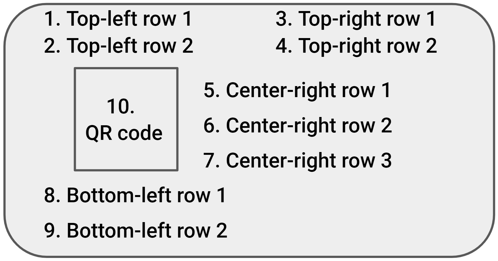
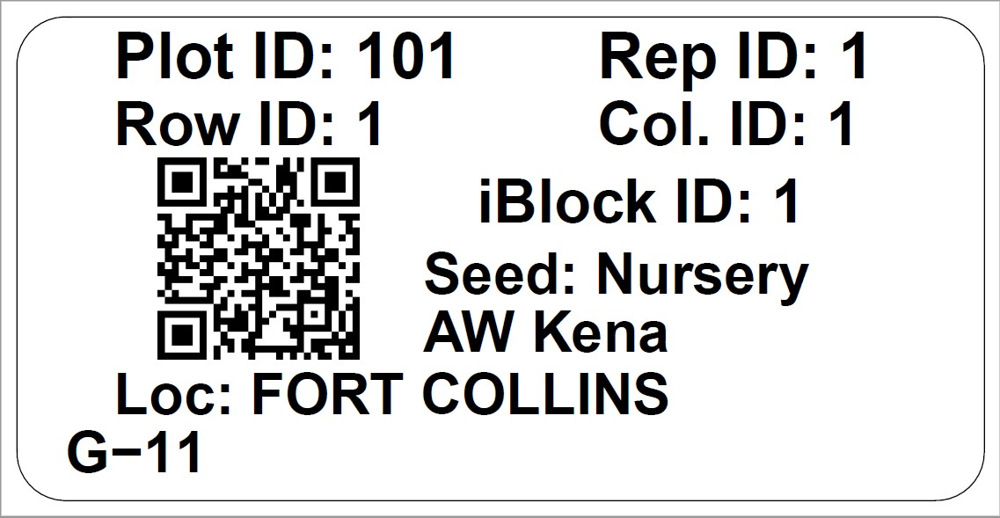
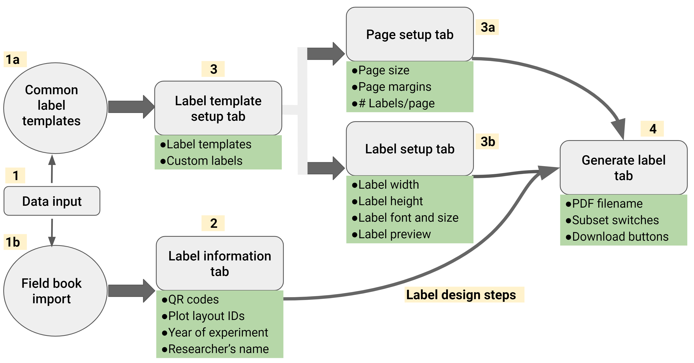

```{r, include = FALSE}
knitr::opts_chunk$set(
  collapse = TRUE,
  comment = "#>"
)
```

<p align="center">
  
</p>


# Table of contents

- [Introduction](#introduction)  
- [Installation](#installation)  
- [Usage](#usage)  
  - [Generating field books](#generating-field-books)  
  - [Plot label design options ](#plot-label-design-options)  
  - [Label content](#label-content)  
  - [QR code generation](#qr-code-generation)
  - [Creating field plot labels in R](#creating-field-plot-labels-in-r)  
  - [Creating general-purpose labels in R](#creating-general-purpose-labels-in-r)   
  - [Creating labels with Shiny app: EasyPlotLabelR](#creating-labels-with-shiny-app-easyplotlabelr)  
    - [Import fieldbook tab](#import-fieldbook-tab)  
    - [Label information tab](#label-information-tab)  
    - [Template setup tab](#template-setup-tab)  
    - [Page setup tab](#page-setup-tab)  
    - [Label setup tab](#label-setup-tab)  
    - [Generate labels tab](#generate-labels-tab)  
    - [Customizing Plot Labels](#customizing-plot-labels)  
- [Conclusion](#conclusion)   

# Introduction

**qrlabelr** is an R package that provides customizable functions and an intuitive Shiny app for generating machine and human-readable plot labels affixed with QR codes. The app is designed to be user-friendly, fast and efficient, allowing researchers to create accurate and highly informative plot labels without the need for licensed commercial software.  

It generates field plot labels that are compatible with the widely used digital data collection mobile app, Field Book. Our software builds on the foundation of an existing open-source program to offer more flexibility in plot label creation steps;  guarantees true string fidelity after QR encoding; and provides faster label generation to users.  

This vignette will guide you through the process of installing the package, and how to use its customizable functions, and the Shiny app.  

# Installation
To install qrlabelr, you will first need to have R and the RStudio IDE installed on your computer. Once you have these tools installed, you can open RStudio and enter the following command in the console to install the package from GitHub:

`install.packages("devtools")`

Now, install the package by running the following commands:  

`library("devtools")`  

`install_github("awkena/qrlabelr")`  

Alternatively, you can install the package together with its vignettes as follows:

`devtools::install_github("awkena/qrlabelr", build_vignettes = TRUE)`

To view vignettes for the package in RStudio, run the following code in the R console:  

``` r
utils::vignette("qrlabelr")
```

Similarly, the vignette can be viewed in your browser by running the following code in your R console:  

``` r
utils::browseVignettes("qrlabelr")
```

The method described above will download and install the `qrlabelr` package on your computer. Once the installation is complete, you can load the package by entering the following command in the console:

`library(qrlabelr)`  

**Users who have R and RStudio already installed must ensure they are up to date before installing qrlabelr**  

# Usage  
## Generating field books  
To use qrlabelr, one must first generate a field book that shows the layout information for all experimental plots. **A field book is required as an input data frame in qrlabelr.**  

Typically, layout information for field plots are obtained based on the experimental design and treatment randomization. It is strongly recommended to have the grid coordinates of plots (row and column numbers of plots) included in the field book.

There are free open-source software such as [FieldHub](https://github.com/DidierMurilloF/FielDHub), which users can use to easily generate an input field book for plot label design in qrlabelr. Other user-preferred software such as BMS can equally be used to generate an input field book if desired.  

**Input field books must be imported as a data frame into qrlabelr for use. We recommend that users save input field books as csv or as xls or xlsx files for easy import to qrlabelr**  

## Plot label design options  
The qrlabelr package offers two user-centered options for creating plot labels affixed with QR codes.  

The first option involves the use of customizable functions to create rectangular field plot labels or any rectangular general-purpose plot labels embossed with QR codes. This option is for users who find working in R comfortable.  

The package also provides a helper function to access a user-friendly Shiny app (EasyPlotLabelR) for non-R users who may find working in R not so comfortable. This option allows users to run the Shiny app using their computer as host without the need for an internet.  

**Both the customizable functions and Shiny app were created to deliver the exact same features, so it all boils down to a user's preference.**  

You can choose to create labels using the Shiny app, or with the use of customizable functions in R. It boils down to a user's preference, as both the functions and Shiny app were created to deliver the exact same features. We were only motivated by the need to serve both groups -- those comfortable with working with codes, and those who prefer to work with a GUI-based application.  

## Label content  

The qrlabelr package designs machine and human-readable plot labels. The specific information that is displayed on plot labels depends on whether one is designing **field plot labels** for field experiments or any **general purpose plot label**.  

Figure 1 shows 10 delineated positions available to users that can be filled with human-readable text items (positions 1 - 9) and machine-readable QR code (position 10).  

||
|:--:| 
| *Fig. 1. Content of rectangular plot label showing 9 delineated text positions and 1 QR code position* |  

For a field plot label, the nine (9) text positions are mapped by default to the following human- readable text items as shown in Figure 2.  

1. Top-left row 1 text position is mapped to **Plot ID**\      
2. Top-left row 2 text position is mapped to **Row ID**\   
3. Top-right row 1 text position is mapped to **Rep ID**\    
4. Top-right row 2 text position is mapped to **Column ID**\    
5. Center-right row 1 text position is mapped to **intra-block ID** number if     the field layout is based on an incomplete block design\      
6. Center-right row 2 text position is mapped to **seed source** for entries      (optional)\    
7. Center-right row 3 text position is mapped to **name of researcher**           (optional)\    
8. Bottom-left row 1 text position is mapped to **Location of experiment** or     trial\    
9. Bottom-left row 2 text position is mapped to **Entry name**\     

**To change any of these default human-readable text items to specific user-preferred texts, use the `gp_label()` customizable function in R or the `General-purpose label with QR code` method in the Shiny app.**  

||
|:--:| 
| *Fig. 2. A field plot label designed using qrlabelr showing 9 human-readable text items and 1 machine-readable QR code* |  


## QR code generation  
Affixing QR codes on the plot labels makes them machine-readable for easy plot identification and tracking. The text for generating QR codes must be unique for each plot.  

The qrlabelr package provides three methods for producing unique IDs for each plot. These methods are **reproducible unique IDs (`RUID`)**, **universal unique IDs (`UUID`)**, and **custom unique IDs (`custom`)**. The RUID method is, however, not available when the user chooses the `gp_label()` function in R or the `General-purpose label` option in the Shiny app.  

RUIDs are informative and reproducible, hence, can be regenerated when provided with the same input fieldbook. For field experiments or trials, we strongly recommend the use of RUIDs. An RUID is generated by concatenating LOCATION and year of experiment, trial name, PLOT, ROW and COLUMN ids for each experimental plot Eg. **`KUMASI2023_PYT_101_1_1`**.  

The UUID method produces random time-based unique IDs that are not reproducible and informative, but are highly unique due to their pseudo-random nature.  

if the input fieldbook contains a column that represents unique IDs suitable for QR code generation, the user can choose the `custom` method.  

Users can set the desired **error correction level (ecl)** for generating QR codes. The ecl indicates how much of the QR code is used up for error correction. There are four levels, with 0 (7%) being the lowest level and 3 (30%) being the highest value possible. For field experiments, we strongly recommend that the error correction level be set to 3, which is the default setting.  


## Creating field plot labels in R  
To create field plot labels in R, use the `field_label()` function. This function creates rectangular field plot labels based on a template, where the page setting and label dimension parameters can be defined by the user using specific arguments.   

For instance, to create field plot labels based on the [Avery 94241 template](https://www.avery.com/blank/labels/94241), the `field_label()` function is used as shown in the code snippet below:   

``` {r eval=FALSE}
library(qrlabelr)

field_label(dat = qrlabelr::square_lattice,
            wdt = 5, 
            hgt = 2,
            page_wdt = 8.5, 
            page_hgt = 11,
            top_mar = 0.75, 
            bot_mar = 0.75, 
            left_mar = 1.75, 
            right_mar = 1.75, 
            numrow = 4L, 
            numcol = 1L, 
            filename = 'PlotLabel', 
            font_sz = 20, 
            Trial = 'PYT', 
            Year = 2023, 
            family = 'sans', 
            rounded = TRUE, 
            IBlock = TRUE,
            get_unique_id = "ruid", 
            rname = "AW Kena", 
            seed_source = TRUE, 
            seed_source_id = "SEED_SOURCE" 
            )
```

The above example creates field plot labels using a sample fieldbook named `square_lattice` generated with the FielDHub package. The `square_lattice` sample fieldbook is available in the `qrlabelr` package, and it was generated based on a Square Lattice Design layout at two locations.  

It follows from the above example that to create any custom rectangular label based on a template, users must specify page setting and label dimension parameters using the following arguments:  

It follows from the above examples that to create any custom rectangular label based on a template, users must specify page setting and label dimension parameters using the following arguments:   

- `wdt`: label width in inches\  
- `hgt`: label height in inches\  
- `page_wdt`: page width in inches\  
- `page_hgt`: page height in inches\  
- `top_mar`: top page margin in inches\  
- `bot_mar`: bottom page margin in inches\  
- `left_mar`: left page margin in inches\  
- `right_mar`: right page margin in inches\  
- `numrow`: number of label rows per page\  
- `numcol`: number of label columns per page\  

The example above creates labels with QR codes generated using the reproducible unique IDs method (`get_unique_id = "ruid"`); researcher's name = `AW Kena`; intra-blocks (`IBlock = TRUE`); and a font family = `sans`.  

The arguments `Trial = 'PYT'` and `Year = 2023` are required if the method for generating unique IDs for QR codes is set to `get_unique_id = "ruid"`.  Users can set the font size for the label using the `font_sz` argument. Rectangular labels with rounded corners are generated with the argument `rounded = TRUE`, else set it to `rounded = FALSE`. 

The following arguments must also be specified if the input field book was not generated with the FieldHub package:  

- `rep_id`: column id in input field book for **REP**; default is 'REP'\  
- `plot_id`: column id in input field book for **PLOT**; default is 'PLOT'\  
- `row_id`: column id in input field book **ROW**; default is 'ROW'\  
- `col_id`: column id in input field book for **COLUMN**; default is 'COLUMN'\  
- `loc_id`: column id in input field book for **LOCATION**; default is           'LOCATION'\   
- `entry_id`: column id in input field book for **TREATMENT** or **ENTRY**;       default is 'TREATMENT'\    
- `IBlock_id`: column id in input field book for **IBLOCK**; default is           'IBLOCK'\  
- `seed_source_id`: column id in input field book for **SEED SOURCE**; default    is 'SEED_SOURCE'\  

The arguments `seed_source = TRUE` and `seed_source_id = "SEED_SOURCE" ` are optional and should be used only when the user intends to show seed source on the field label.  

The function creates a pdf file with a name prefix of `PlotLabel` that is saved to the user's working directory. The function also saves an updated fieldbook to the  user's working directory which can be exported to the Field Book mobile app for digital data collection.  


## Creating general-purpose labels in R  

The `gp_label()` function allows for specific user-defined human-readable text items that can be used to fill out the nine (9) delineated text positions on the label. This function gives a lot of control to the user with respect to what human-readable text items gets displayed on the label.  

To create any general-purpose labels other than a field plot label, invoke the `gp_label()` function as has been done in the code snippet below:  

```{r eval=FALSE}
gp_label(dat = qrlabelr::square_lattice,
         get_unique_id = "uuid",
         font_sz = 10,
         family = "sans",
         top_left_txt1 = 'Plot:',
         top_left_txt2 = 'Row:', 
         top_right_txt1 = 'Rep:',
         top_right_txt2 = 'Col:',
         center_right_txt1 = 'iBlock:',
         center_right_txt2 = 'Seed:',
         center_right_txt3 = 'Adepa',
         bottom_left_txt1 = 'Loc:',
         top_left_id1 = 'PLOT',
         top_left_id2 = 'ROW',
         top_right_id1 = 'REP',
         top_right_id2 = 'COLUMN',
         center_right_id1 = 'IBLOCK',
         center_right_id2 = 'SEED_SOURCE',
         bottom_left_id1 = 'LOCATION',
         bottom_left_id2 = 'TREATMENT'
)
```


The above arguments are passed to the `create_label()` function to generate the desired labels based on the defined page setting and label dimension parameters.  

To view details of the `field_label()` and the `gp_label()` functions in RStudio, run the following codes in the R console:  

``` r
?qrlabelr::field_label
?qrlabelr::gp_label

```

**Note that the default label template for both the `field_label()` and the `gp_label()` functions is [Avery 94220 template](https://www.avery.com/blank/labels/94220).**  

## Creating labels with Shiny app: EasyPlotLabelR  

To create your first plot label using the Shiny app, you will need to open the EasyPlotLabelR Shiny app. You can do this by entering the following command in the console:  

`qrlabelr::run_app()`

This will open a new window in your default web browser that displays the EasyPlotLabelR Shiny app. The user is then greeted with a Welcome page that provides an overview of the web app, some quick instructions to get started, sample labels, among others. In the header of the web app is a convenient Help button which can be accessed anytime for a quick overview of the purpose of each tab in generating a label.  

Figure 3 shows the main pages or tabs available in the Shiny app and their corresponding features.  

||
|:--:| 
| *Fig. 3. Workflow of the Shiny app, EasyPlotLabelR* | 


### Import fieldbook tab  

To create plot labels, start by clicking on the "Import fieldbook" sidebar menu. This presents a page with a number of input widgets all geared towards the upload of a fieldbook. Click the "Browse..." button and navigate to a desired fieldbook in CSV, XLS, or XLSX format. If the fieldbook was generated with FieldHub or BMS, turn on the "Generated with FieldHub" or Generated with BMS switch respectively. These switches allow users to automatically populate relevant input widgets fields that will be covered in subsequent sections. However, users should turn off these switches if the imported fieldbook was generated using other programs.  

To preview the uploaded fieldbook right in the app, turn on the switch labelled "Preview Fieldbook". This displays the uploaded fieldbook in a dedicated card from which the fieldbook can be examined, but not modified. Click the "Submit Fieldbook" button after all the necessary configurations have been made, and click the Next button to move to the next tab.  

In case a fieldbook is yet to be generated, a "Launch FielDHub" button has been provided for convenience. This opens the GitHub page of the author of FielDHub in a new window, allowing for the fast and easy generation of a fieldbook.  

### Label information tab  

This page contains widgets for choosing the type of label to generate, as well as populating the individual labels with information.  

The first widget on this tab allows for the selection of the type of label to create. Choose Field plot labels with QR codes, the default option, to generate plot labels for field experiments. Otherwise, to create a general-purpose label, choose the General-purpose label with QR code option.  

Choosing the Field plot labels with QR codes option presents the user with three methods for setting unique IDs to be used to generate QR codes -- Reproducible unique IDs (RUID), Universal unique IDs (UUID), and Custom unique IDs.  

**Using the RUID method to produce unique IDs for QR code generation requires the user to first fill out all designated input widgets for label information before clicking the "Generate QR codes" to generate the unique QR codes**. The "Generate QR codes" button is inactivated until a fieldbook is uploaded.  

There is also an option to show the seed source on the label which can be activated by ticking the corresponding checkbox. To allow for even more informative plot labels, there are options to input both the name of the researcher and the trial name.  

The widget labeled "Incomplete blocks", as can be inferred from the name, should be ticked if the experimental design consists of incomplete blocks. If checked, the user will be required to provide the input ID of the incomplete blocks using its designated widget.  

Lastly, there are drop-down input widgets for defining the various parameters of the imported fieldbook if the type of label to generate is Field plot labels. The options provided in these widgets correspond to the various names in the uploaded fieldbook. However, if general-purpose labels are to be generated, at each desired position, the prefix of the parameter to be displayed, and the ID of the parameter in the imported fieldbook are both to be defined by the user. It should be noted that not all positions have to be filled -- only those desired by the user.  

Once the desired information has been defined for all the required fields as well as QR codes generated, click the Next button to continue to the next tab.  

### Template setup tab  

This tab allows the user to choose one of the preset rectangular label templates. Choosing one of the preset templates speeds things up significantly, and is definitely recommended! Choose from the number of options provided that suits your needs. The template selected by default is Avery 94200, but a user may well choose any of the provided templates or define his or her own values and parameters by choosing a 'Custom' template.  

For more information on the provided templates, use the **Common labels** table as a guide. It features a number of parameters such as the label width and height, page height and width margins, the number of columns and rows, among others. For more information, click the Help! button located at the center of the header of the page.  

Click the Next button once a desired template has been chosen.  

### Page setup tab  

This page allows for the customization of page-specific parameters. If the desired template is set to Custom, the widgets on this page will have to be defined manually. Care should be taken to set values that correspond to the desired outcome. If none of the templates provided is suitable for a particular task, it is advisable to first start with a template that is closest to producing the desired outcome and modifying the parameters as necessary.  

All values entered in the fields, apart from the Number of rows and Number of columns, must be in inches. We recommend using the Common labels tab to have a fair idea of the range and combinations of values that can be safely entered to generate labels, especially if the labels will be printed on special papers from vendors such as Avery and Uline.  

Once all values have been entered and verified, click the Next button to proceed to the next tab.  

### Label setup tab  

Similar to the Page setup page, this page allows for the customization of label-specific parameters. A list of font families is provided, one of which can be chosen. Options include a monospace font type (Courier), a Sans (Helvetica) type, and a Sans-serif type (Times). Users can also set the default font size as well, which is set to 8 by default.  

In addition, it is possible to choose a label to preview by specifying the row number of the plot in the imported fieldbook using the designated widget. This feature is based on the fact that each row in the imported fieldbook corresponds to a single plot label. The preview is rendered in a dedicated card directly below the Next button.  

If no template or Custom is chosen in the Template setup page, the label width and height will have to be defined as well. Lastly, there is an option to generate labels with rounded or sharp corners.  

After setting the desired values and being satisfied with the preview, click the Next button to proceed to the next and final tab.  

### Generate labels tab  

On this page are a number of input widgets related to the output -- a PDF file containing the desired labels.  

There is a text input box to enter a prefix of the file to be downloaded. One can also choose to print all labels or only a subset of labels by using the "Print by REP and LOCATION" switch. By default, the program allows users to generate labels by LOCATION subsets.  

Once plot labels have been customized and created, it can be saved for printing and future use by clicking on the "Download labels" button in the app. This will save the generated labels as a PDF file. Note that this button will be enabled only after the successful generation of labels.  

Users have the option to download an augmented fieldbook which contains all the unique IDs that were used in generating the unique QR codes, if either the RUID or UUID method was chosen in the Label information tab.  

### Customizing Plot Labels  

The Shiny app offers a wide range of customization options for your plot labels. You can choose from a variety of different templates, label type, and font styles to create a label that is tailored to your specific needs and preferences. To access the customization options, configure the appearance of the labels using the options provided in the app.  

## Conclusion  

This user-friendly R package allows researchers to easily generate machine and human-readable plot labels. With its easy-to-use web app and wide range of customization options, the incorporated Shiny app makes it simple to create accurate and informative plot labels without the need for licensed commercial software. Give qrlabelr a try and enjoy the convenience it brings to your work!  
